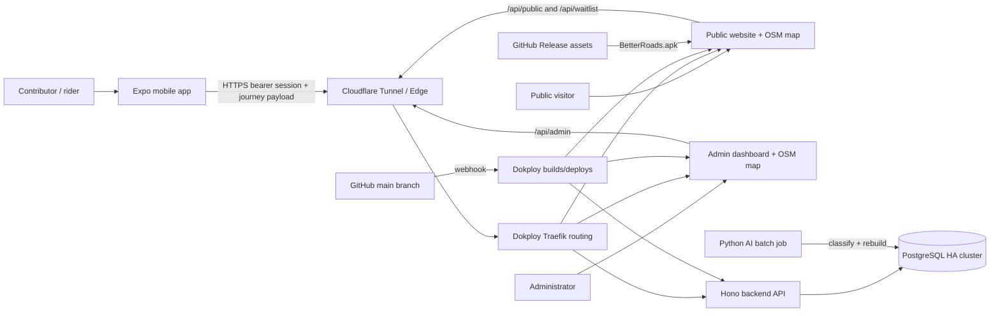
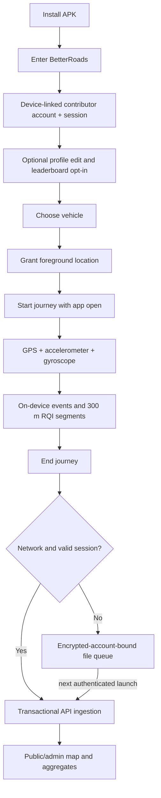
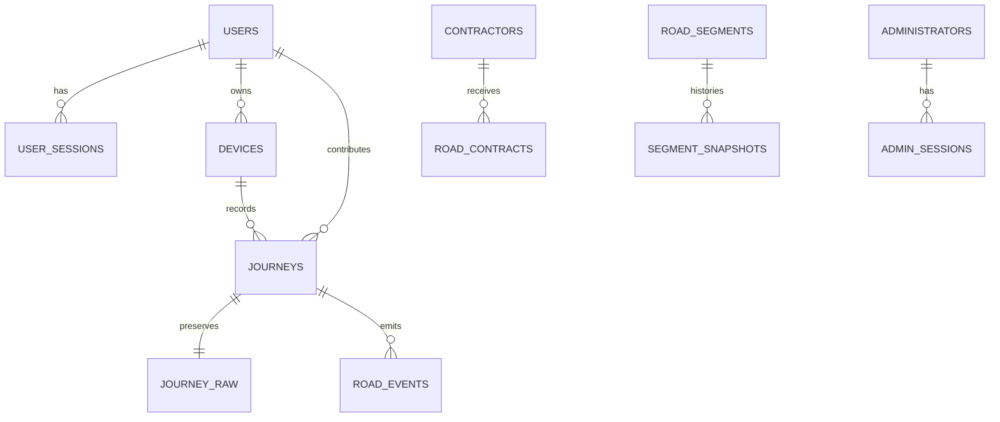

# BetterRoads architecture, operations, status, and release guide

Last code review: **14 August 2026 (IST)**

Repository: `msr157/betterroads`

Production branch: `main`

This is the main technical reference for how the BetterRoads website, public
map, API, administrator panel, mobile app, database, AI batch engine, and
deployment infrastructure connect. It also records what is working, what is
still incomplete, and which launch tasks require an external account or a real
device.

## 1. Current outcome

BetterRoads is a monorepo containing four deployable applications plus a batch
AI/data-rebuild service:

| Component | Technology | Purpose | Deployment |
| --- | --- | --- | --- |
| Public website and public panel | React 19, Vite, MapLibre GL | Marketing pages, APK download, legal pages, public road-quality map, timeline, leaderboard, and published contracts | Root `Dockerfile`, nginx, Dokploy |
| Backend API | Node.js, Hono, Zod, Drizzle ORM | Identity, journey ingestion, public data, waitlist, and administrator APIs | `backend/Dockerfile`, Dokploy |
| Administrator panel | React 19, Vite, MapLibre GL | Operations, journeys, devices, waitlist, live cities, contracts, map analytics, exports, and admin security | `dashboard/Dockerfile`, Dokploy |
| Mobile app | React Native, Expo SDK 57 | Contributor identity, foreground journey sensing, RQI/event calculation, offline queue, and upload | Signed APK/AAB built separately |
| AI batch engine | Python 3.11+, psycopg | Cross-journey event classification and deterministic aggregate rebuild | Scheduled Docker/cron job |

The source tree builds successfully. Website, API, and admin production builds
pass; the mobile app typechecks; mobile sensor tests pass; and all 81 AI tests
pass.

## 2. OpenStreetMap decision

**Yes: BetterRoads uses OpenStreetMap for its basemap. It does not use Google
Maps, Mapbox maps, Bing Maps, HERE Maps, or another proprietary basemap.**

The exact arrangement is:

| Concern | Current implementation |
| --- | --- |
| Browser map renderer | MapLibre GL, an open-source renderer |
| Public map tiles | CartoDB `light_nolabels` + CartoDB `light_only_labels` |
| Admin map tiles | `https://tile.openstreetmap.org/{z}/{x}/{y}.png` |
| Border compliance | DataMeet India composite GeoJSON (`india-simplified.geojson`) overlay |
| Attribution | `© OpenStreetMap contributors, © CARTO` |
| Road-condition overlays | BetterRoads GeoJSON from PostgreSQL through the API |
| Contract overlays | BetterRoads-published GeoJSON, rendered above OSM |
| Google integration | Optional Google identity linking in test mobile builds only; it is not a map provider |

There is one important distinction:

- The **visible basemap on the public map uses CartoDB's borderless tiles with an official India boundary GeoJSON overlay**. This architectural decision ensures strict compliance with Indian mapping laws (showing the entirety of Jammu, Kashmir, and Ladakh) without relying on proprietary or paid API keys.
- The road aggregation engine does **not yet map-match GPS traces to OSM way
  IDs**. It currently groups observations into quantized geographic cells of
  roughly 100 m. OSM way/segment map-matching remains a data-engine roadmap
  item and is needed to avoid collisions where two roads cross the same cell.

## 3. System connection diagram



## 4. Repository layout

```text
betterroads/
├── backend/              Hono API, schema, migrations, Docker image
├── dashboard/            administrator SPA and OSM analytics map
├── website/              public site, public OSM map, legal/download pages
├── mobile/app/           Expo Android/iOS app and signed-release script
├── ai/                   Python classification/rebuild batch engine
├── docs/                 contracts, identity, deployment, and release guides
├── scripts/              validation and Android build wrappers
├── .github/workflows/    CI and Android release automation
├── Dockerfile            public website production image
└── docker-compose.yml    simple local website container setup
```

The root pnpm workspace intentionally includes only `website` and `backend`.
`dashboard` and `mobile/app` use their own npm lockfiles. `ai` is a Python
package.

## 5. Public website and public panel

### Routes and responsibilities

| Route | Function |
| --- | --- |
| `/` | Public campaign/marketing site |
| `/map` | India-bounded OSM map with RQI roads, event markers, timeline, contributor data, and published road contracts |
| `/app` | Android download and installation information |
| `/privacy` | Privacy policy |
| `/terms` | Terms of service |
| `/delete-account` | Public account deletion instructions |
| `/downloads/BetterRoads.apk` | nginx redirect to the latest stable GitHub Release APK |
| `/health` | Website container health endpoint |

The map lazily loads MapLibre so the large map bundle does not block the
landing page. It calls same-origin `/api/public/*` endpoints by default. The
public map is bounded to India and overlays BetterRoads-owned GeoJSON on OSM.

Public data is intentionally privacy-limited:

- Road RQI and event aggregates are public.
- Only users who explicitly opt into the leaderboard are public.
- Google subject, email, date of birth, gender, and other private profile data
  are excluded from public queries.
- Road contracts appear publicly only when an administrator marks them as
  published.

### Advanced Feedback System
The public website and mobile app feature a unified feedback subsystem:
- Submissions require a user to have a completed profile (Name & Email) to prevent anonymous spam.
- An integrated Math CAPTCHA prevents automated bot submissions.
- Silent metadata capture tags each submission with the `source` (website vs app), `deviceOs`, and `location` (timezone) to assist in triage without encumbering the user.
- On mobile devices, the Map Legend and Stats panels collapse into Floating Action Buttons (FABs) to prevent overlapping over the map view.

## 6. Mobile app user flow



### Identity

The stable v1.1.0 channel uses **device-linked entry** rather than mandatory
Google sign-in:

1. The app creates a random installation UUID.
2. `POST /api/mobile/auth/guest` creates or resumes the contributor linked to
   that device record.
3. The API returns a random 90-day bearer token.
4. The token and cached profile are stored in Expo Secure Store.
5. The contributor receives an immutable public ID and an editable unique
   username.
6. Google linking/sign-in exists only in the test release channel for now.

Current limitation: the device UUID is acting as the resume credential for
device entry. It is random and normally private to the installation, but it is
not a true secret. Before treating this as strong authentication, add a second
installation secret stored in Secure Store and store only its hash on the
server. Google/account recovery should also be enabled in the stable channel
before users depend on long-term account recovery.

### Journey sensing

While the app is open it uses:

- Foreground location at navigation accuracy.
- Accelerometer and gyroscope sampling at approximately 50 Hz.
- Vehicle-specific vibration baselines.
- A 500 ms RMS window.
- Speed-gated bump/pothole and swerve detection.
- Approximately 300 m journey segments.
- RQI from 10 to 100, based on roughness and event penalties.
- A downsampled GPS path at most once every two seconds.

The app currently does **not** record reliably with the screen off, in the
background, or after Android kills it. Background location would require an
Android foreground service, explicit Play Console declarations, and additional
real-device battery/lifecycle testing.

### Offline behavior

Completed journeys upload immediately when possible. Otherwise the app writes
the complete payload to `pending-journeys` in the app document directory. A
queued journey is bound to the local BetterRoads user ID and is retried only
after that same account is restored. The server uses the client journey UUID
as an idempotency key.

## 7. Backend API

The API starts only after database migrations and the first-administrator
bootstrap succeed. A migration/bootstrap failure terminates the process so a
bad schema cannot be promoted as a healthy container.

### Route groups

| Prefix | Consumers | Main functions |
| --- | --- | --- |
| `/api/mobile` | Mobile app | Device entry, Google exchange/link, profile, sessions, logout, deletion |
| `/api/user/mobile/traveldata` | Mobile app | Authenticated end-of-journey ingestion |
| `/user/mobile/traveldata` | Direct/spec alias | Same ingestion handler |
| `/api/public` | Website/public clients | Roads, events, timeline, stats, leaderboard, contributors, published contracts |
| `/api/admin` | Administrator panel | Login, overview, operations, search, alerts, account security, contracts, map/replay/export |
| `/api/waitlist` | Website | Join and displayed count |
| `/health`, `/api/health` | Infrastructure/operators | API health and release identity |

### Ingestion transaction

For an accepted journey, the API:

1. Rate-limits the request.
2. Enforces the 15 MiB body limit before JSON parsing.
3. Resolves and revalidates the mobile bearer session.
4. Validates the schema, coordinate ranges, timestamps, and India coverage.
5. Checks journey UUID idempotency and ownership.
6. Upserts the installation/device.
7. Inserts the journey row and full raw payload.
8. Inserts road events.
9. Updates road-segment RQI aggregates and daily snapshots.
10. Sets `accepted_at` only after the whole transaction completes.

Only journeys with `accepted_at` contribute to public rankings.

### Security model

- Mobile and administrator tokens are random 256-bit credentials.
- Only HMAC-SHA-256 token hashes are stored in PostgreSQL.
- Administrator passwords use scrypt.
- Mobile sessions last 90 days; administrator sessions last 24 hours.
- Sessions can be individually revoked or revoked in bulk.
- CORS is an explicit production allowlist.
- Mutation/auth endpoints have IP rate limiting.
- Account deletion removes identity/session ownership and keeps measurements
  only as anonymous, non-ranked road data.

The in-memory rate limiter is per API process. If the API is scaled to multiple
replicas, move rate-limit state to Redis or another shared store.

## 8. Database model



| Table | Purpose |
| --- | --- |
| `users` | Contributor identity, profile, public ID, username, optional Google/email, leaderboard consent |
| `user_sessions` | Revocable hashed mobile sessions |
| `devices` | Random installation UUID, owner, platform/model/version, journey count |
| `journeys` | Accepted trip summary and ownership |
| `journey_raw` | Verbatim payload for replay and future reprocessing |
| `road_events` | Pothole/bump/speed-breaker/swerve/manual event evidence |
| `road_segments` | Current cell-level RQI aggregate |
| `segment_snapshots` | Daily historical RQI state for the timeline |
| `waitlist_signups` | Public interest/waitlist entries |
| `administrators` | Admin account, password hash, display preferences |
| `admin_sessions` | Revocable hashed admin sessions |
| `contractors` | Contractor directory |
| `road_contracts` | Tender/contract/accountability records and optional geometry |
| `feedbacks` | User-submitted feedback/bug reports containing metadata (OS/location) |

## 9. AI/data engine

The Python job is a batch intelligence layer, not an online inference service.
It reads retained journeys/events and writes corrected aggregates.

Current commands:

- `classify`: clusters repeated bump/pothole events and reclassifies consistent
  multi-device clusters as likely speed breakers.
- `rebuild`: deterministically rebuilds road segments and daily snapshots from
  retained journey payloads.
- `run-all`: classify, then rebuild.

Current limits:

- RQI still originates from on-device time-domain scoring.
- Raw sensor windows are not uploaded by the mobile app yet.
- There is no FFT surface analysis or learned vehicle normalization yet.
- Road identity is the ~100 m grid, not an OSM way.

The production schedule documented in the deployment knowledge base is nightly
at 02:30.

## 10. Administrator panel

The administrator panel is a separate authenticated SPA. Its sections are:

| Panel | Function |
| --- | --- |
| Overview | Counts and 14-day journey/event trends |
| Live | City-level recent activity and recent journeys |
| Journeys | Paginated journey operations table |
| Devices | Installation/device inventory |
| Waitlist | Public signup records |
| Map Analytics | OSM basemap, RQI segments, events, published contracts, filters, replay, GeoJSON export |
| Contracts | Contractor CRUD, road-contract CRUD, CSV template/import, publication control |
| Profile & security | Admin profile, UI preferences, password change, session revocation |

The admin token is stored in browser `localStorage`. This is acceptable for the
current internal panel only if the site remains strongly protected from XSS.
For a broader operator rollout, consider secure same-site HTTP-only cookies and
CSRF protection.

## 11. Deployment architecture

### Production request path

```text
Browser/mobile
  -> Cloudflare edge and tunnel
  -> host port 80 / Dokploy Traefik
  -> website, dashboard, or backend Swarm service
  -> PostgreSQL HA cluster where required
```

Cloudflare terminates public TLS. Tunnel ingress reaches Traefik through the
host/bridge route documented in `docs/DEPLOYMENT_KB.md`. The applications
therefore listen internally over HTTP and expose health endpoints.

### Live hosts

| Host/path | Service |
| --- | --- |
| `https://betterroads.org` and `https://www.betterroads.org` | Public website |
| `https://betterroads.org/api/*` | Backend API through path routing |
| `https://admin.betterroads.org` | Administrator dashboard |
| `https://admin.betterroads.org/api/*` | Backend API through admin-host path routing |
| `https://betterroads.rackops.in` | Alternate/internal admin host |

### CI/CD

On pushes and pull requests, GitHub Actions:

1. Installs locked pnpm/npm dependencies.
2. Builds the backend, website, and dashboard.
3. Typechecks the mobile app.
4. Runs backend, mobile, and AI tests.
5. Builds all three production Docker images.

On `main`, Dokploy is expected to deploy the website, backend, and dashboard
through configured GitHub webhooks. Android is deliberately separate: tags or
manual workflow dispatch can build signed stable/test assets when signing
secrets are configured.

## 12. Live verification snapshot

Observed on **14 August 2026 around 20:45 IST**:

| Check | Result |
| --- | --- |
| `betterroads.org` | 200 OK |
| Website `/health` | 200 OK |
| Public `/map` and `/app` SPA routes | 200 OK |
| `admin.betterroads.org` | 200 OK; DNS/tunnel is now working |
| Admin `/health` | 200 OK |
| API `/api/health` | 200 OK, but returned the older `migrationError` response shape |
| Public stats/timeline | Working, currently zero journeys/segments/events |
| New leaderboard/contracts endpoints | 404 on the live API during this check |
| Latest stable APK redirect | Points to GitHub Release `v1.0.1` |
| Repository mobile version | `1.1.0`, Android `versionCode` 2 |

The live API was therefore behind `main` at review time even though the website
and admin host were reachable. The next pushed `main` commit must trigger or be
followed by a backend Dokploy deployment. After deployment, verify that
`/api/health` reports release `device-identity-v2` and that
`/api/public/leaderboard` and `/api/public/contracts` no longer return 404.

## 13. What is working

- Public website, public map route, app/download route, and legal routes.
- OSM basemap on the public and administrator maps.
- Public RQI/event/timeline API shape.
- Device-linked contributor creation and Secure Store session restoration.
- Profile editing, leaderboard opt-in, logout, session APIs, and deletion.
- Foreground GPS/motion journey recording.
- On-device event detection and RQI segment calculation.
- Offline journey queue and idempotent authenticated upload design.
- Transactional backend ingestion and raw-payload retention.
- Public contributor/contracts code paths on `main`.
- Administrator authentication and operational panels.
- Contractor/contract CRUD, CSV import, publication controls, replay, and export.
- Nightly AI classification/rebuild implementation and tests.
- Website/backend/dashboard Docker builds and CI definitions.
- Stable/test Android release scripts and GitHub release workflow.

## 14. Remaining work, in priority order

### P0: launch blockers

1. **Deploy the current backend.** The live API is stale and does not expose
   the current identity/public-contract endpoints.
2. **Build and publish v1.1.0 APK/AAB.** The website still downloads v1.0.1
   until the new stable GitHub Release asset is published.
3. **Real-device end-to-end test.** Verify entry, permission denial/retry,
   recording, stop/upload, offline recovery, profile, deletion, and server
   attribution on at least one supported Android phone.
4. **Seed/collect real journeys.** Production currently reports zero road
   data, so the public map has no BetterRoads overlays to demonstrate.
5. **Verify production admin login and contract publication** after the backend
   deploy, including CORS on `admin.betterroads.org`.

### P1: important engineering work

1. Add a hashed installation secret so device entry is not recoverable from a
   UUID alone; define stable account recovery/linking.
2. Map-match retained GPS traces to OSM ways/segments and rebuild historical
   keys from `journey_raw`.
3. Decide whether background recording is a v1 requirement; if yes, implement
   foreground-service recording and complete Play policy/battery testing.
4. Add mobile history, map, leaderboard, session-management, and queued-upload
   support screens.
5. Add database-backed integration tests for mobile auth, ingestion,
   idempotency, deletion, public privacy boundaries, and admin authorization.
6. Add shared/distributed rate limiting before scaling the API horizontally.
7. Define an OSM tile hosting/cache plan before public map traffic grows.
8. Upload raw sensor windows only after payload/storage/privacy costs are
   designed, then add server-side signal reprocessing.

### P2: quality and scale

1. Split the large public-map and dashboard bundles further.
2. Replace long one-line UI components with smaller tested components.
3. Remove or source any unused placeholder statistics before reusing them.
4. Add observability: structured error reporting, request IDs, ingestion
   metrics, queue/rejection dashboards, and AI job alerts.
5. Test and release iOS separately.

## 15. Work that can be done from this repository

The following can be implemented, tested, committed, and pushed directly:

- Backend/API fixes, migrations, validation, privacy, and auth hardening.
- Website, public map, OSM attribution, and truthful product copy.
- Administrator panels, map analytics, contracts, and exports.
- Mobile TypeScript features that do not require final device validation.
- AI matching/classification/rebuild work.
- CI, Dockerfiles, release scripts, and documentation.
- Automated unit/integration tests.

The following require the owner or external credentials/hardware:

- Starting Docker Desktop and running the signed Android build locally.
- Access to the upload keystore/password if they are not present.
- Dokploy/Cloudflare changes when the webhook or routing is broken.
- Real Android sensor, permission, battery, and lifecycle testing.
- GitHub Release publication if repository credentials are unavailable.
- Play Console forms, screenshots, tester enrollment, and rollout.
- Real road-data collection.

## 16. Build the Android release in a separate terminal

Prerequisites:

- Docker Desktop is installed and running.
- `mobile/app/signing/betterroads-upload.jks` exists.
- `mobile/app/signing/keystore-password.txt` exists.
- The current `mobile/app/app.json` version/versionCode are correct. The current
  values are version `1.1.0` and Android `versionCode` 2.

From PowerShell:

```powershell
cd D:\Codes\betterroads

docker version
Test-Path mobile\app\signing\betterroads-upload.jks
Test-Path mobile\app\signing\keystore-password.txt

npm run build:apk
```

The first build may take a long time because Docker, npm, Expo, Android SDK,
Gradle, and native dependencies may need to download/cache artifacts.

Expected stable outputs:

```text
mobile/app/release/BetterRoads.apk
mobile/app/release/BetterRoads-v1.1.0.apk
mobile/app/release/BetterRoads-v1.1.0.aab
```

Check them with:

```powershell
Get-ChildItem mobile\app\release -File |
  Select-Object Name, Length, LastWriteTime

Get-FileHash mobile\app\release\BetterRoads.apk -Algorithm SHA256
```

Use the APK for direct installation/testing. Use the AAB for Google Play. For
the Google-enabled test channel, run `npm run build:apk:test` instead; it
produces `BetterRoads-Test*` files and requires valid Google OAuth client IDs.

After the stable build passes device testing, publish the generic
`BetterRoads.apk` plus the versioned APK/AAB on a stable GitHub Release so the
website's `/downloads/BetterRoads.apk` redirect updates automatically.

## 17. Post-deploy smoke test

Run these after every backend/website/admin deployment:

```powershell
curl.exe -sS https://betterroads.org/health
curl.exe -sS https://betterroads.org/api/health
curl.exe -sS https://admin.betterroads.org/health
curl.exe -sS https://admin.betterroads.org/api/health
curl.exe -sS https://betterroads.org/api/public/stats
curl.exe -sS "https://betterroads.org/api/public/leaderboard?limit=3"
curl.exe -sS https://betterroads.org/api/public/contracts
```

Then manually verify:

1. Public website and mobile layout.
2. OSM attribution on `/map` and the admin Map Analytics panel.
3. Admin login and logout.
4. Contract create/publish/unpublish and public overlay visibility.
5. A real mobile journey upload and appearance in admin/public data.
6. Account deletion and removal from public rankings.
