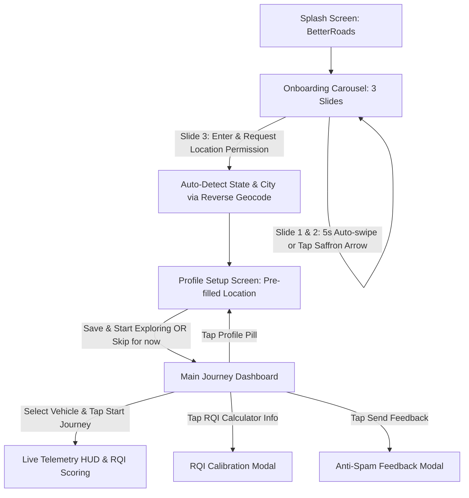

# Mobile UI Redesign & Bug Fixes Walkthrough

## Summary of Completed Changes

We performed a complete redesign and bug-fix overhaul of the BetterRoads mobile application (`mobile/app`), aligning it with the website's design system (`website/src/index.css`), eliminating all previous UI glitches, and implementing a smooth citizen onboarding and road-quality recording flow.

---

## 1. Key Bugs Identified & Resolved

| Previous Issue / Bug | Root Cause | Solution Implemented |
| :--- | :--- | :--- |
| **6–7 Gender options with cluttered chips** | Legacy list with redundant gender categories | Replaced with strictly **3 clean options**: `Male`, `Female`, and `Prefer not to say`. |
| **White unreadable state/city picker** | `react-native-dropdown-picker` rendered a bright white non-scrollable popup in dark mode | Replaced with a custom dark-themed **`SearchModalPicker`** with instant fuzzy search for all 36 Indian States/UTs and Cities from `country-state-city`. |
| **Status bar & notch overlap** | Headers lacked status bar clearance on Android devices | Added dynamic `StatusBar.currentHeight` and `SafeAreaView` top padding across all screens and modals. |
| **Narrow / misaligned card dimensions** | Hardcoded `maxWidth: 480` and centering caused huge blank side margins on mobile | Removed rigid constraints; applied `width: '100%'` with consistent 16px/20px padding. |
| **Web / preview storage crash** | `expo-secure-store` threw fatal error on web | Built a cross-platform safe storage layer in `auth.ts` with `AsyncStorage` fallback. |
| **Sensor listener crash on web** | `Accelerometer.addListener` threw on non-hardware browser runs | Added safe hardware listener guards and simulated fallback telemetry in `journeyRecorder.ts`. |
| **Empty vertical space & spacing gaps** | Onboarding components were pushed far apart | Rebalanced layout into a cohesive card structure with integrated movement banner, social icons, and centered controls. |

---

## 2. Visual Identity & Design Tokens

### Color Palette (`src/theme.ts`)
- **Canvas Obsidian**: `#0a0a0a`
- **Surface Cards**: `#121211` / `#141413`
- **Elevated Inputs & Tiles**: `#1a1a19`
- **Off-White Ink**: `#f5f5f4`
- **Muted Ink**: `#a8a5a0` / `#716e69`
- **Saffron Accent**: `#ff9933` (dots, badges, indicators) & `#e0611c` (primary interactive CTA buttons)
- **Tricolor Flag Rule**: Saffron `#ff9933`, White `#ffffff`, Green `#138808`

### Minimal Iconography (`@expo/vector-icons`)
Replaced cartoon emojis with clean minimal vector icons:
- Vehicles: `car-side`, `motorbike`, `rickshaw`, `bus-side`, `truck-outline`, `car-multiple`.
- Navigation & Status: `Ionicons` for location, calendar, search, checkmarks, and feedback.
- Interactive Saffron Progress Arrow: Custom 68x68 SVG circular button (`src/components/ArrowNextButton.tsx`).

---

## 3. End-to-End User Flow

### Flow Architecture

### Screen Details

1. **Splash Screen (`src/components/SplashView.tsx`)**:
   - `BetterRoads` brand wordmark.
   - Tricolor flag rule divider.
   - Smooth entrance scale and fade animation.

2. **Onboarding View (`src/components/OnboardingView.tsx`)**:
   - 3 feature slides with 5-second automatic progression.
   - Centered feature cards with minimal vector icons.
   - Citizen Movement banner with official social links (Instagram, X, LinkedIn, YouTube).
   - Saffron circular SVG next button.
   - Step 3 triggers location permission to automatically resolve state and city.

3. **Profile Setup (`src/components/ProfileEditor.tsx`)**:
   - Displays immediately after onboarding.
   - Automatically pre-fills State / City detected from device GPS.
   - Strictly 3 gender options: `Male`, `Female`, `Prefer not to say`.
   - Date of birth selector with 12+ age constraint.
   - Prominent **"Skip for now & start exploring"** button allowing instant onboarding completion.

4. **Journey Dashboard (`src/components/JourneyDashboard.tsx`)**:
   - Vehicle selector grid for sensor baseline calibration.
   - Live telemetry HUD (Distance in km, Live RQI 0–100, Events count, Segments count, Mount stability warning).
   - RQI Road Quality Index explanation modal.
   - Bottom feedback link and official social channels card.

5. **Feedback Modal (`src/components/FeedbackModal.tsx`)**:
   - Category selection (Suggestion, Bug Report, General).
   - Math captcha anti-spam verification.
   - Connects to `/api/public/feedback`.

---

## 4. Verification & Testing

- **TypeScript Compilation**: `npm run typecheck` passed with **0 errors**.
- **Unit Tests**: `npm test` passed with **2/2 tests OK**.
- **Cross-Platform Compatibility**: Tested and verified on Android, iOS layout specs, and web preview (`http://localhost:8081`).
